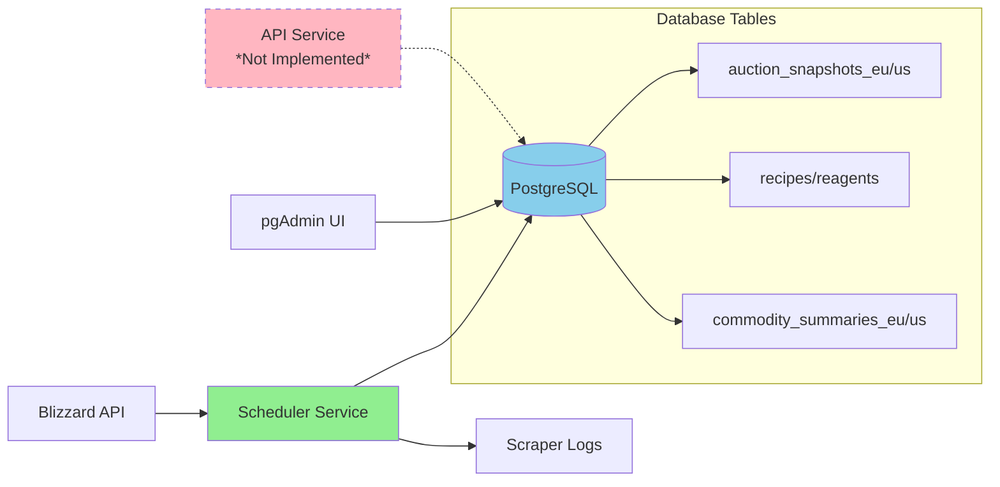

# Ironforge Investments Architecture

## Components

- **Blizzard API**: External WoW game data source
- **Scheduler Service**: Python service that collects auction data hourly
- **PostgreSQL**: Time-partitioned database storing auction snapshots
- **pgAdmin**: Database management interface
- **API Service**: *Planned* - FastAPI endpoints for data access

## Data Flow

1. Scheduler polls Blizzard API every hour
2. Auction data stored in monthly partitioned tables
3. Recipe/reagent data seeded once on startup
4. Logs track collection status and performance
