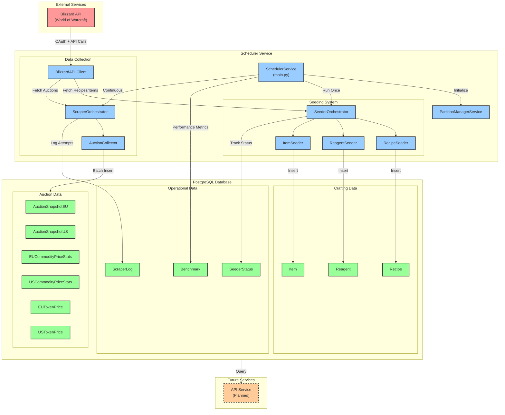

# Ironforge Investments - System Architecture

## Overview

Ironforge Investments is a data collection and analysis platform for World of Warcraft auction house data. The system collects auction data from both EU and US regions, stores it in a time-partitioned PostgreSQL database, and provides analysis capabilities for identifying market opportunities.

## High-Level System Architecture



## Component Descriptions

### Scheduler Service

The main application service that orchestrates all data collection and processing activities.

**Key Components:**

- **SchedulerService** (`main.py`): Entry point that initializes partitions, runs seeding, and starts continuous scraping
- **Signal Handling**: Graceful shutdown on SIGINT/SIGTERM signals

### Seeding System

One-time data population from Blizzard API for crafting-related data.

**Components:**

- **SeederOrchestrator**: Manages seeding workflow and tracks completion status
- **RecipeSeeder**: Fetches all professions, skill tiers, and recipes from Blizzard API
- **ReagentSeeder**: Extracts ingredients/reagents for each recipe
- **ItemSeeder**: Populates item metadata (names, levels, types)

**Data Flow:**

```
Blizzard API → Seeder → Repository → PostgreSQL
```

### Data Collection System

Continuous auction house data collection with intelligent polling.

**Components:**

- **ScraperOrchestrator**: Manages polling schedule (:30 past each hour) and retry logic
- **AuctionCollector**: Collects and processes auction data for a specific region
- **BlizzardAPI Client**: Handles OAuth, API requests, caching, and change detection

**Key Features:**

- **Change Detection**: Uses HTTP If-Modified-Since headers to skip unchanged data (304 responses)
- **Caching**: 60-second in-memory cache to avoid redundant API calls
- **Batch Processing**: Inserts data in 5000-record chunks
- **Dual Region Support**: Separate collection for EU and US

**Data Flow:**

```
Blizzard API → BlizzardAPI Client → AuctionCollector → Repository → PostgreSQL
```

### PostgreSQL Database

Time-partitioned storage for auction data and crafting information.

**Auction Data Tables:**

- **AuctionSnapshotEU/US**: Raw auction snapshots (auction_id, item_id, price, quantity, time_left)
- **EU/USCommodityPriceStats**: Aggregated statistics (min/max/mean/median prices, sales estimates)
- **EU/USTokenPrice**: WoW Token price tracking

**Crafting Data Tables:**

- **Recipe**: Crafting recipes with profession, skill tier, crafted item
- **Reagent**: Recipe ingredients with quantities and optionality
- **Item**: Item metadata and properties

**Operational Tables:**

- **SeederStatus**: Tracks which seeders have completed
- **ScraperLog**: Logs all scraper attempts with status and errors
- **Benchmark**: Performance metrics for operations

**Partitioning Strategy:**

- Auction tables are time-partitioned by snapshot_time for efficient querying
- Daily partition maintenance runs automatically

### Future Services

**API Service (Planned)**

- FastAPI-based service for querying auction data
- Will provide endpoints for price history, market analysis, and crafting profitability

## Data Collection Schedule

- **Initial Seeding**: Runs once on startup (if not completed)
- **Auction Collection**: Every hour at :30 past the hour
- **Polling Window**: 30-minute window with 30-second intervals
- **Partition Maintenance**: Daily (automatic)

## Technology Stack

- **Language**: Python 3.11+
- **Database**: PostgreSQL with time-based partitioning
- **ORM**: SQLAlchemy 2.0
- **API Client**: Requests with urllib3 retry strategy
- **Type Checking**: BasedPyright (strict mode)
- **Formatting**: Ruff (PEP 8)
- **Package Manager**: UV

## Repository Pattern

All database access follows the repository pattern:

```
Models (SQLAlchemy) ← Repositories ← Services/Seeders/Collectors
```

**Repositories:**

- `AuctionRepositoryEU/US`: Auction data access
- `RecipeRepository`: Recipe management
- `ReagentRepository`: Reagent/ingredient management

## Next Steps

See the following sections for detailed diagrams:

- [Data Flow Diagram](#data-flow-diagram)
- [Component Interactions](#component-interactions)
- [Data Model](#data-model)
- [Sequence Diagrams](#sequence-diagrams)
