# Ironforge Investments - System Architecture

## Table of Contents

- [Overview](#overview)
- [High-Level System Architecture](#high-level-system-architecture)
- [Component Descriptions](#component-descriptions)
- [Data Collection Schedule](#data-collection-schedule)
- [Data Flow Diagram](#data-flow-diagram)
- [Component Interactions](#component-interactions)
- [Data Model](#data-model)
- [Sequence Diagrams](#sequence-diagrams)
- [Component Inventory](#component-inventory)
- [Technology Stack](#technology-stack)
- [Repository Pattern](#repository-pattern)
- [Next Steps](#next-steps)

## Overview

Ironforge Investments is a data collection and analysis platform for World of Warcraft auction house data. The system collects auction data from both EU and US regions, stores it in a time-partitioned PostgreSQL database, and provides analysis capabilities for identifying market opportunities.

## High-Level System Architecture

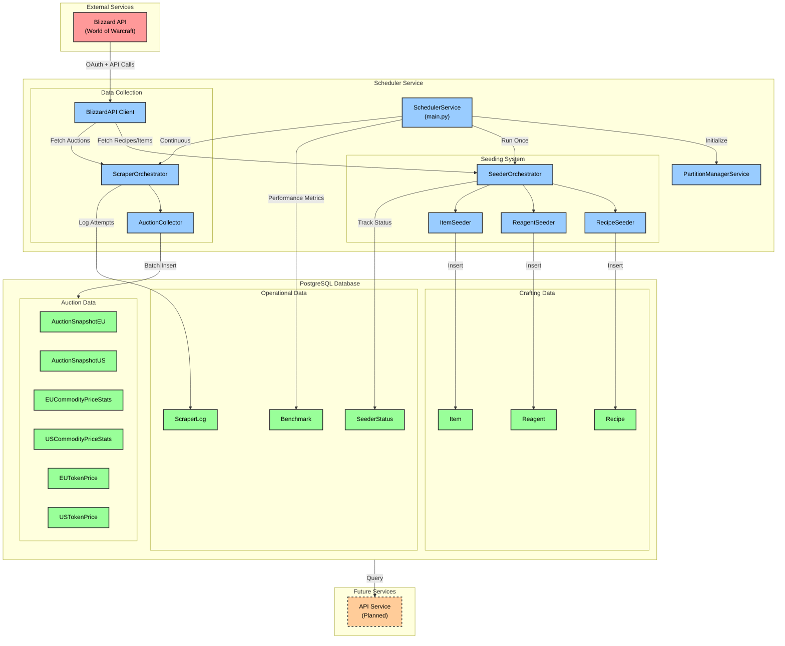

## Component Descriptions

### Scheduler Service

The main application service that orchestrates all data collection and processing activities.

**Key Components:**

- **SchedulerService** (`main.py`): Entry point that initializes partitions, runs seeding, and starts continuous scraping
- **Signal Handling**: Graceful shutdown on SIGINT/SIGTERM signals

### Seeding System

One-time data population from Blizzard API for crafting-related data.

**Components:**

- **SeederOrchestrator**: Manages seeding workflow and tracks completion status
- **RecipeSeeder**: Fetches all professions, skill tiers, and recipes from Blizzard API
- **ReagentSeeder**: Extracts ingredients/reagents for each recipe
- **ItemSeeder**: Populates item metadata (names, levels, types)

**Data Flow:**

```
Blizzard API → Seeder → Repository → PostgreSQL
```

### Data Collection System

Continuous auction house data collection with intelligent polling.

**Components:**

- **ScraperOrchestrator**: Manages polling schedule (:30 past each hour) and retry logic
- **AuctionCollector**: Collects and processes auction data for a specific region
- **BlizzardAPI Client**: Handles OAuth, API requests, caching, and change detection

**Key Features:**

- **Change Detection**: Uses HTTP If-Modified-Since headers to skip unchanged data (304 responses)
- **Caching**: 60-second in-memory cache to avoid redundant API calls
- **Batch Processing**: Inserts data in 5000-record chunks
- **Dual Region Support**: Separate collection for EU and US

**Data Flow:**

```
Blizzard API → BlizzardAPI Client → AuctionCollector → Repository → PostgreSQL
```

### PostgreSQL Database

Time-partitioned storage for auction data and crafting information.

**Auction Data Tables:**

- **AuctionSnapshotEU/US**: Raw auction snapshots (auction_id, item_id, price, quantity, time_left)
- **EU/USCommodityPriceStats**: Aggregated statistics (min/max/mean/median prices, sales estimates)
- **EU/USTokenPrice**: WoW Token price tracking

**Crafting Data Tables:**

- **Recipe**: Crafting recipes with profession, skill tier, crafted item
- **Reagent**: Recipe ingredients with quantities and optionality
- **Item**: Item metadata and properties

**Operational Tables:**

- **SeederStatus**: Tracks which seeders have completed
- **ScraperLog**: Logs all scraper attempts with status and errors
- **Benchmark**: Performance metrics for operations

**Partitioning Strategy:**

- Auction tables are time-partitioned by snapshot_time for efficient querying
- Daily partition maintenance runs automatically

### Future Services

**API Service (Planned)**

- FastAPI-based service for querying auction data
- Will provide endpoints for price history, market analysis, and crafting profitability

## Sequence Diagrams

### Auction Data Collection Sequence

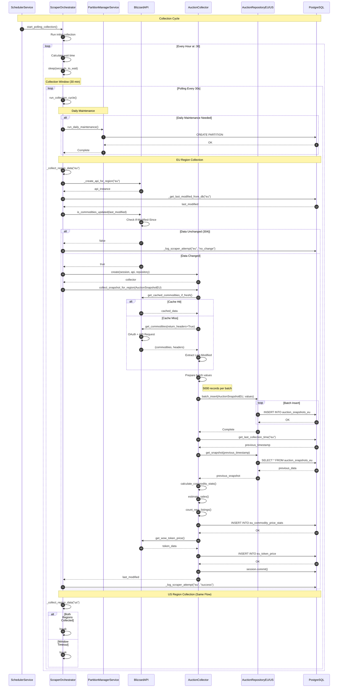

### Recipe Seeding Sequence

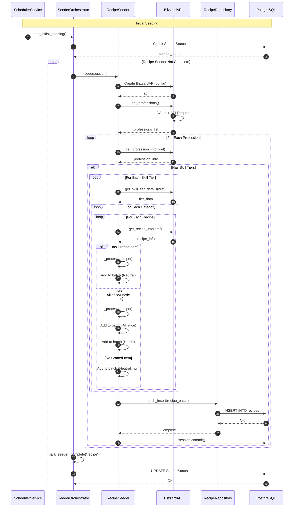

### Reagent Seeding Sequence

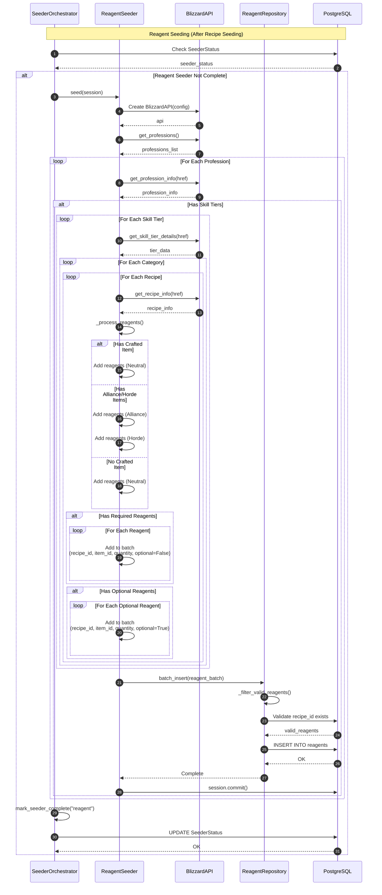

### Error Handling in Sequences

**Auction Collection Errors:**

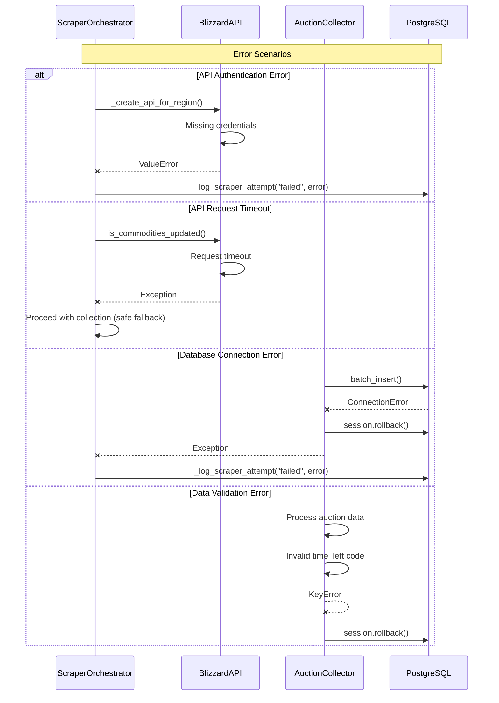

**Seeding Errors:**

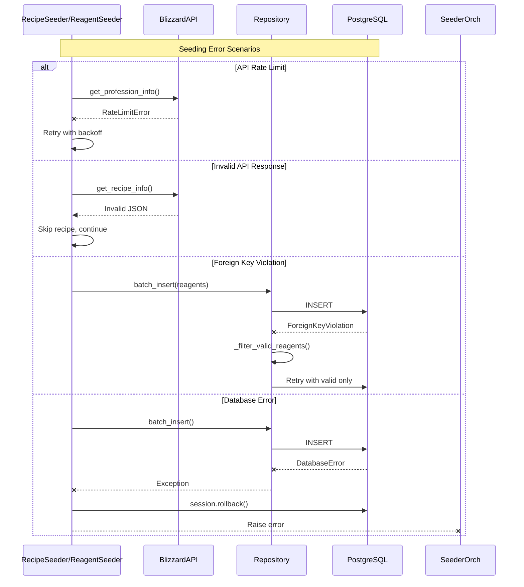

## Data Collection Schedule

- **Initial Seeding**: Runs once on startup (if not completed)
- **Auction Collection**: Every hour at :30 past the hour
- **Polling Window**: 30-minute window with 30-second intervals
- **Partition Maintenance**: Daily (automatic)

## Data Flow Diagram

This diagram illustrates the complete data flow from the Blizzard API through the system to the PostgreSQL database.

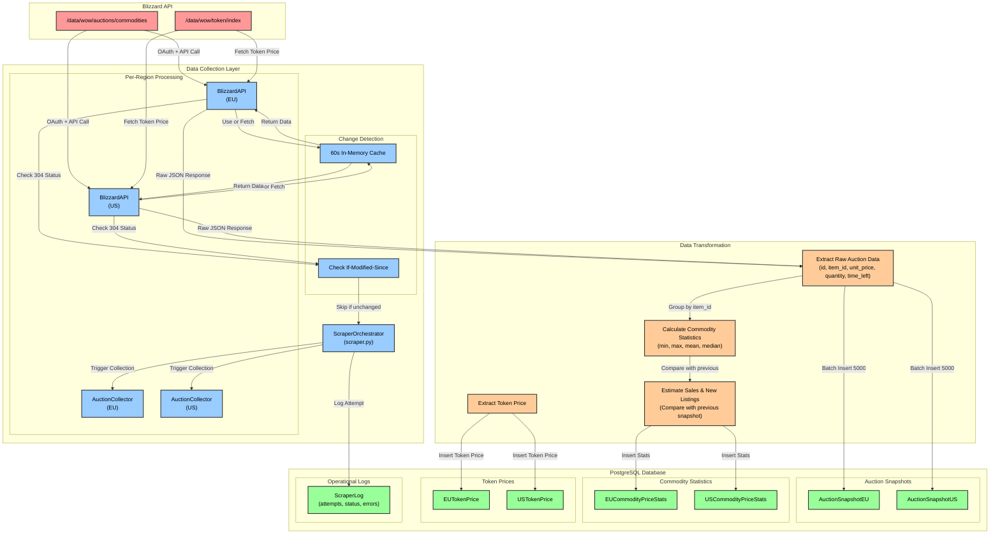

### Data Flow Description

**1. API Request Phase**
- ScraperOrchestrator triggers collection at :30 past each hour
- BlizzardAPI client checks 60-second in-memory cache first
- If cache miss, makes OAuth-authenticated request to Blizzard API
- Uses `If-Modified-Since` header to detect changes (304 response if unchanged)

**2. Data Extraction Phase**
- Raw auction data extracted: `id`, `item_id`, `unit_price`, `quantity`, `time_left`
- Time-left codes converted: SHORT(1), MEDIUM(2), LONG(3), VERY_LONG(4)
- WoW Token price fetched from separate endpoint

**3. Data Transformation Phase**
- Auctions grouped by `item_id` for statistical analysis
- Statistics calculated per commodity:
  - Min/Max prices
  - Mean and median prices
  - Total quantity available
- Sales estimation by comparing with previous snapshot:
  - Items no longer present = estimated sales
  - New auction IDs = new listings

**4. Data Storage Phase**
- **Auction Snapshots**: Batch inserted in 5000-record chunks
- **Commodity Statistics**: Aggregated data with sales estimates
- **Token Prices**: Timestamp and price stored
- **Operational Logs**: Every attempt logged with status and errors

**5. Dual Region Support**
- Parallel processing for EU and US regions
- Separate API clients, collectors, and database tables per region
- Independent change detection and caching
- Collection continues even if one region fails

## Component Interactions

### Auction Collection Flow

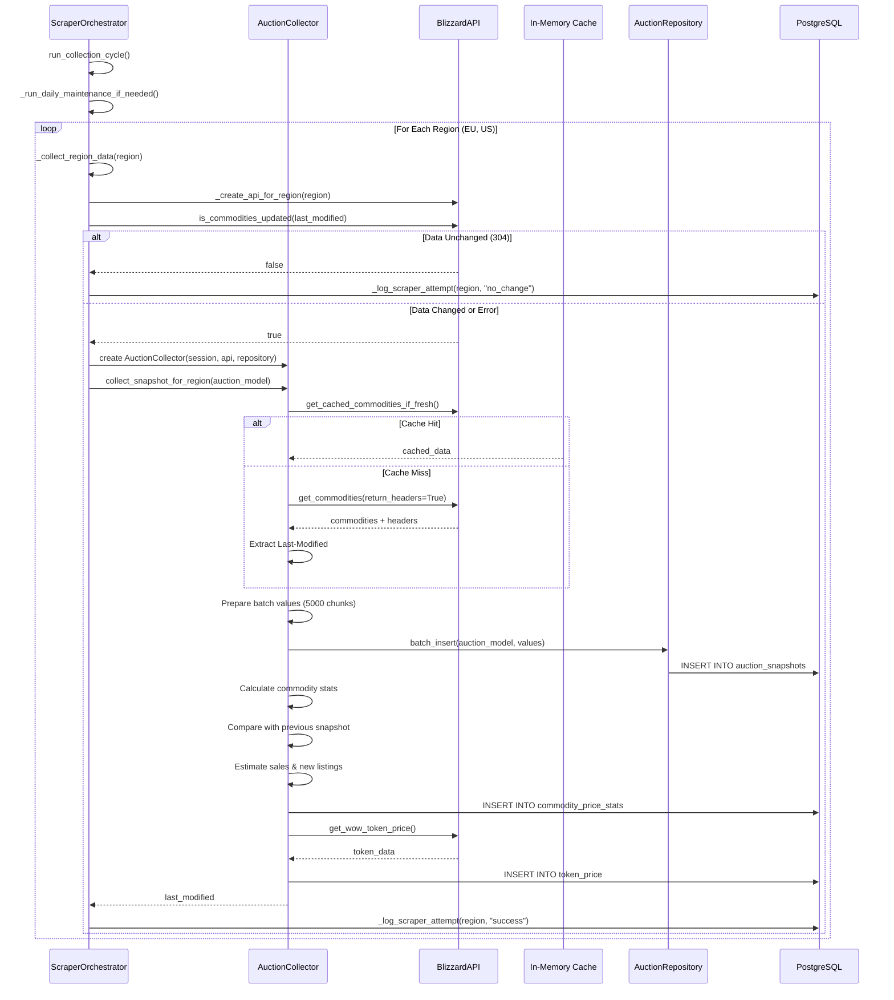

### Seeding Flow

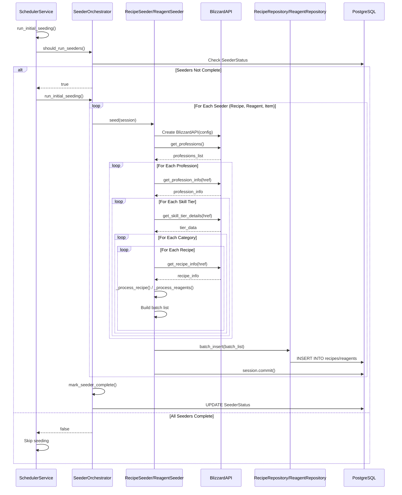

### Error Handling Flow

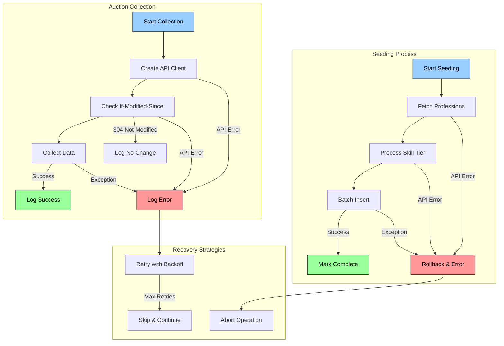

### Component Interaction Summary

**Auction Collection Flow:**
1. **ScraperOrchestrator** manages the collection cycle and polling schedule
2. **AuctionCollector** handles data extraction and transformation per region
3. **BlizzardAPI** provides OAuth authentication and API access with caching
4. **AuctionRepository** abstracts database operations with batch inserts
5. **PostgreSQL** stores snapshots, statistics, and operational logs

**Seeding Flow:**
1. **SeederOrchestrator** checks completion status and runs seeders sequentially
2. **RecipeSeeder/ReagentSeeder** fetch crafting data from Blizzard API
3. **RecipeRepository/ReagentRepository** handle database insertions
4. **SeederStatus** tracks which seeders have completed

**Error Handling:**
- **API Errors**: Logged to ScraperLog with error message
- **Database Errors**: Session rollback, error logged
- **Change Detection**: 304 responses skip unnecessary collection
- **Retry Logic**: Built into BlizzardAPI with urllib3 retry strategy

## Technology Stack

- **Language**: Python 3.11+
- **Database**: PostgreSQL with time-based partitioning
- **ORM**: SQLAlchemy 2.0
- **API Client**: Requests with urllib3 retry strategy
- **Type Checking**: BasedPyright (strict mode)
- **Formatting**: Ruff (PEP 8)
- **Package Manager**: UV

## Repository Pattern

All database access follows the repository pattern:

```
Models (SQLAlchemy) ← Repositories ← Services/Seeders/Collectors
```

**Repositories:**

- `AuctionRepositoryEU/US`: Auction data access
- `RecipeRepository`: Recipe management
- `ReagentRepository`: Reagent/ingredient management

## Data Model

### Entity Relationship Diagram - Auction Data

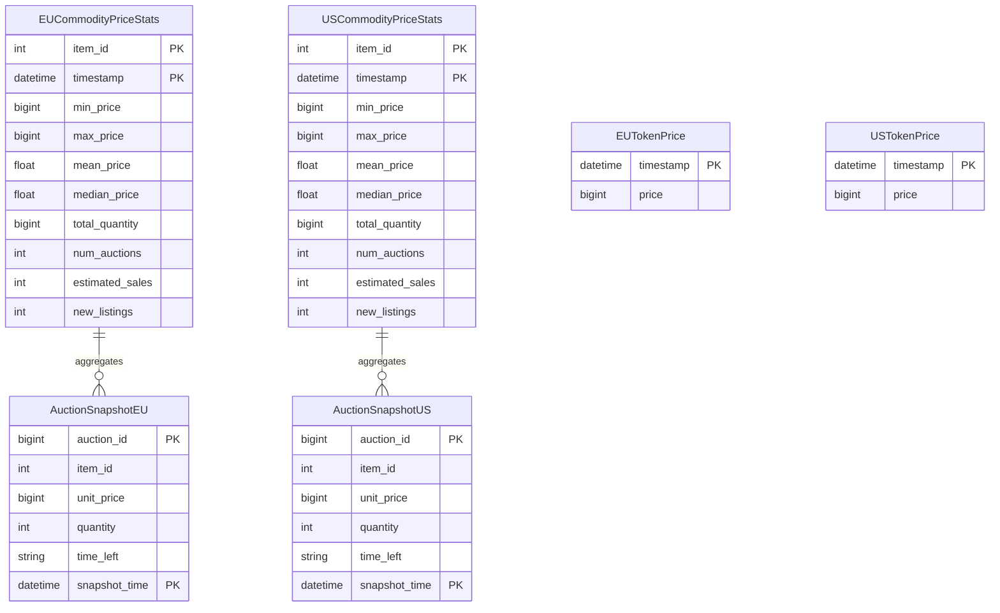

### Entity Relationship Diagram - Crafting Data

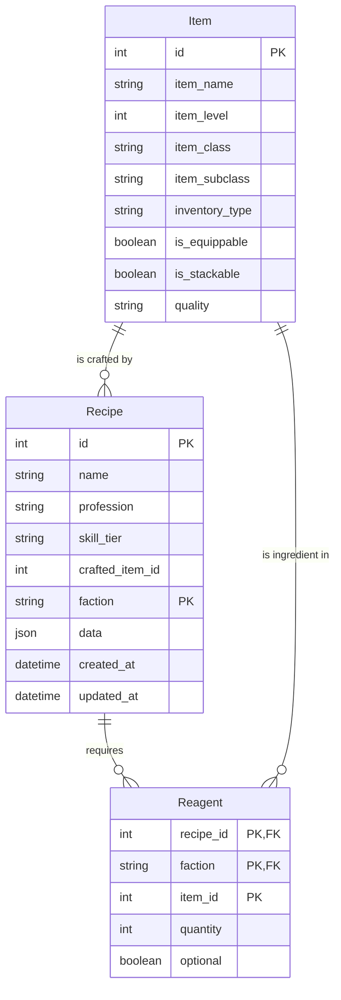

### Entity Relationship Diagram - Operational Data

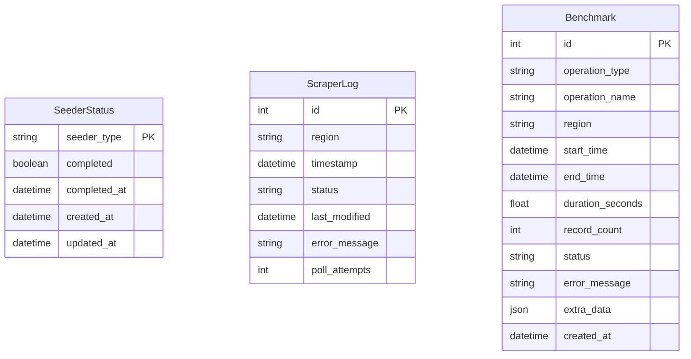

### Table Descriptions

**Auction Data Tables:**

| Table | Description | Primary Key | Partitioned |
|-------|-------------|-------------|-------------|
| `AuctionSnapshotEU/US` | Raw auction snapshots | (auction_id, snapshot_time) | Yes |
| `EU/USCommodityPriceStats` | Aggregated commodity statistics | (item_id, timestamp) | No |
| `EU/USTokenPrice` | WoW Token price history | timestamp | No |

**Crafting Data Tables:**

| Table | Description | Primary Key | Relationships |
|-------|-------------|-------------|---------------|
| `Recipe` | Crafting recipes | (id, faction) | - |
| `Reagent` | Recipe ingredients | (recipe_id, faction, item_id) | FK → Recipe |
| `Item` | Item metadata | id | Referenced by Reagent |

**Operational Tables:**

| Table | Description | Primary Key |
|-------|-------------|-------------|
| `SeederStatus` | Tracks seeding completion | seeder_type |
| `ScraperLog` | Logs all scraper attempts | id |
| `Benchmark` | Performance metrics | id |

### Partitioning Strategy

**Time-Based Partitioning:**

- **AuctionSnapshotEU/US** tables are partitioned by `snapshot_time`
- Daily partitions created automatically
- Partitions named: `auction_snapshots_eu_2024_01_15`, etc.
- Old partitions can be archived or dropped for data retention

**Benefits:**
- Efficient querying by date range
- Fast data deletion (drop partition vs DELETE)
- Parallel processing capabilities
- Better index performance

**Partition Maintenance:**
- Runs daily during collection cycle
- Creates partitions for upcoming days
- Managed by `PartitionManagerService`

## Component Inventory

### Service Layer Components

| Component | File Path | Description | Key Methods |
|-----------|-----------|-------------|-------------|
| **SchedulerService** | `src/main.py` | Main entry point orchestrating all services | `run_initial_seeding()`, `start_services()`, `stop_services()` |
| **ScraperOrchestrator** | `src/scraper/scraper.py` | Manages auction data collection and polling | `run_collection_cycle()`, `start_polling_collection()`, `_collect_region_data()` |
| **AuctionCollector** | `src/scraper/auction_collector.py` | Collects and processes auction data per region | `collect_snapshot_for_region()`, `get_last_collection_time()`, `get_snapshot()` |
| **SeederOrchestrator** | `src/seeding/seeder.py` | Manages seeding workflow and completion status | `should_run_seeders()`, `run_initial_seeding()`, `mark_seeder_complete()` |
| **RecipeSeeder** | `src/seeding/recipes.py` | Fetches and stores crafting recipes | `seed()`, `_process_recipe()` |
| **ReagentSeeder** | `src/seeding/reagents.py` | Extracts and stores recipe ingredients | `seed()`, `_process_reagents()` |
| **ItemSeeder** | `src/seeding/items.py` | Populates item metadata | `seed()` |
| **PartitionManagerService** | `src/utils/partition_manager.py` | Manages database partition creation | `run_daily_maintenance()`, `create_partitions()` |

### Data Access Layer (Repositories)

| Component | File Path | Description | Key Methods |
|-----------|-----------|-------------|-------------|
| **AuctionRepositoryEU** | `src/repository/auction_repository_eu.py` | EU auction data access | `batch_insert()`, `get_snapshot()` |
| **AuctionRepositoryUS** | `src/repository/auction_repository_us.py` | US auction data access | `batch_insert()`, `get_snapshot()` |
| **RecipeRepository** | `src/repository/recipe_repository.py` | Recipe management | `batch_insert()`, `get_recipe_by_id_and_faction()`, `get_recipes_by_profession()` |
| **ReagentRepository** | `src/repository/reagent_repository.py` | Reagent/ingredient management | `batch_insert()`, `get_reagents_by_recipe()`, `_filter_valid_reagents()` |

### External API Integration

| Component | File Path | Description | Key Methods |
|-----------|-----------|-------------|-------------|
| **BlizzardAPI** | `src/scraper/blizzard_api_utils.py` | OAuth-authenticated API client | `get_commodities()`, `is_commodities_updated()`, `get_wow_token_price()`, `get_professions()`, `get_recipe_info()` |
| **BlizzardConfig** | `src/scraper/blizzard_api_utils.py` | API configuration dataclass | Configuration for client_id, client_secret, region, timeout |

### Database Models

| Model | File Path | Description | Primary Key |
|-------|-----------|-------------|-------------|
| **EUCommodityPriceStats** | `src/models/models.py` | EU commodity price statistics | (item_id, timestamp) |
| **USCommodityPriceStats** | `src/models/models.py` | US commodity price statistics | (item_id, timestamp) |
| **AuctionSnapshotEU** | `src/models/models.py` | EU raw auction snapshots | (auction_id, snapshot_time) |
| **AuctionSnapshotUS** | `src/models/models.py` | US raw auction snapshots | (auction_id, snapshot_time) |
| **EUTokenPrice** | `src/models/models.py` | EU WoW Token prices | timestamp |
| **USTokenPrice** | `src/models/models.py` | US WoW Token prices | timestamp |
| **Recipe** | `src/models/models.py` | Crafting recipes | (id, faction) |
| **Reagent** | `src/models/models.py` | Recipe ingredients | (recipe_id, faction, item_id) |
| **Item** | `src/models/models.py` | Item metadata | id |
| **SeederStatus** | `src/models/models.py` | Seeding completion tracking | seeder_type |
| **ScraperLog** | `src/models/models.py` | Scraper attempt logs | id |
| **Benchmark** | `src/models/models.py` | Performance metrics | id |

### Utility Components

| Component | File Path | Description | Key Functions |
|-----------|-----------|-------------|---------------|
| **Database Connection** | `src/repository/database.py` | SQLAlchemy session management | `get_engine()`, `get_session()`, `db_session()` |
| **Auction Utilities** | `src/utils/auction_utils.py` | Auction data calculations | `calculate_commodity_stats()`, `estimate_sales()`, `count_new_listings()` |
| **Benchmark Manager** | `src/utils/benchmark.py` | Performance tracking | `start_benchmark()`, `end_benchmark()` |
| **Polling Config** | `src/scraper/polling_config.py` | Collection scheduling | `SimplePollingConfig` |

### Key Design Patterns

1. **Repository Pattern**: All database access through repository classes
2. **Orchestrator Pattern**: High-level service coordination
3. **Context Manager**: Database session management with automatic cleanup
4. **Batch Processing**: Chunked inserts (5000 records per batch)
5. **Caching**: 60-second in-memory cache for API responses
6. **Change Detection**: HTTP 304 Not Modified handling
7. **Partitioning**: Time-based table partitioning for auction data

### Component Dependencies

```
SchedulerService
├── SeederOrchestrator
│   ├── RecipeSeeder → RecipeRepository → Recipe
│   ├── ReagentSeeder → ReagentRepository → Reagent
│   └── ItemSeeder → ItemRepository → Item
├── ScraperOrchestrator
│   ├── AuctionCollector → AuctionRepositoryEU/US → AuctionSnapshotEU/US
│   └── BlizzardAPI (OAuth client)
└── PartitionManagerService
```

## Next Steps

See the following sections for detailed diagrams:

- [Data Flow Diagram](#data-flow-diagram)
- [Component Interactions](#component-interactions)
- [Data Model](#data-model)
- [Sequence Diagrams](#sequence-diagrams)
